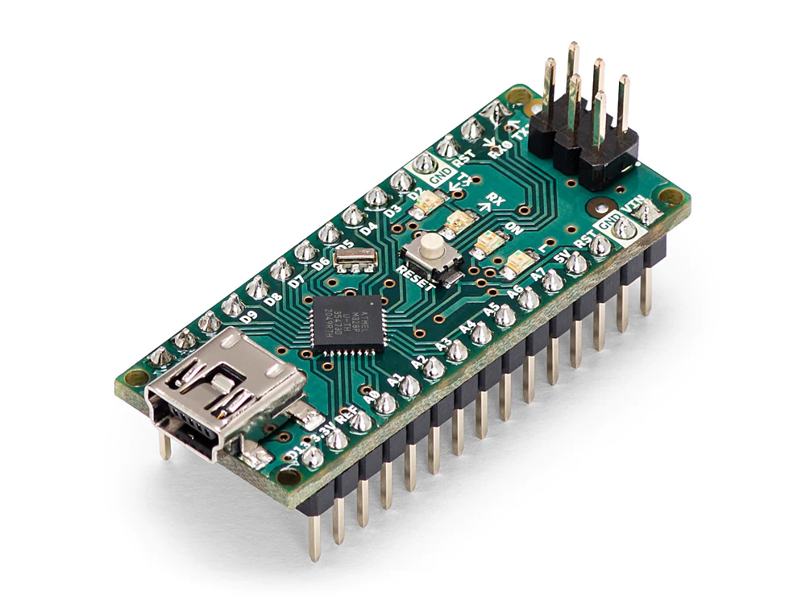
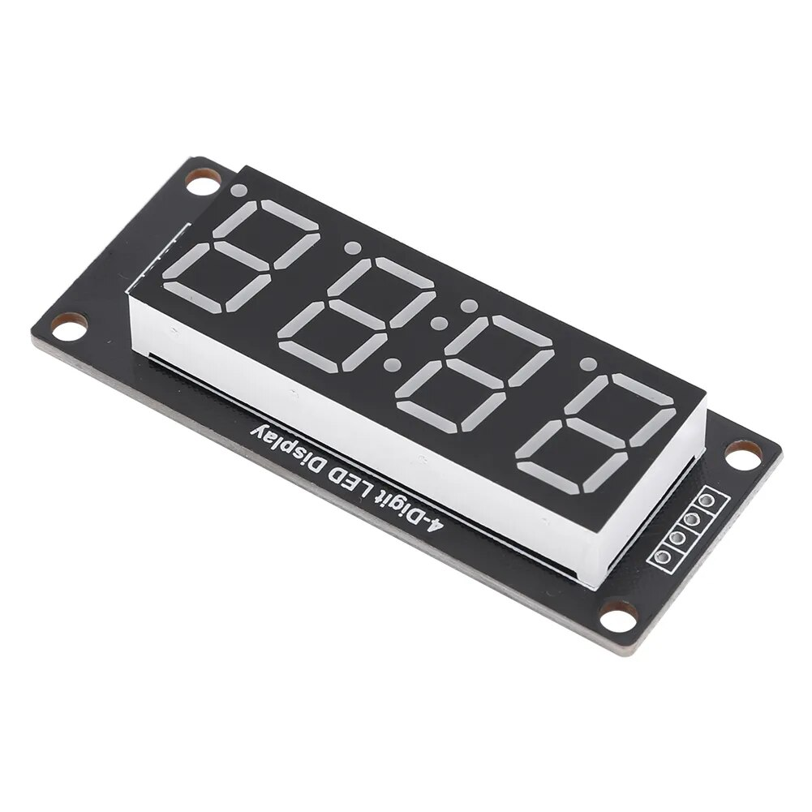
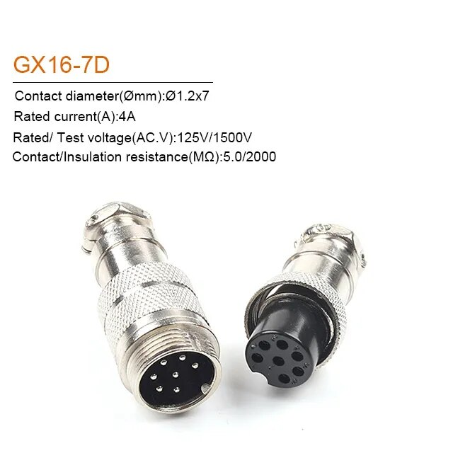
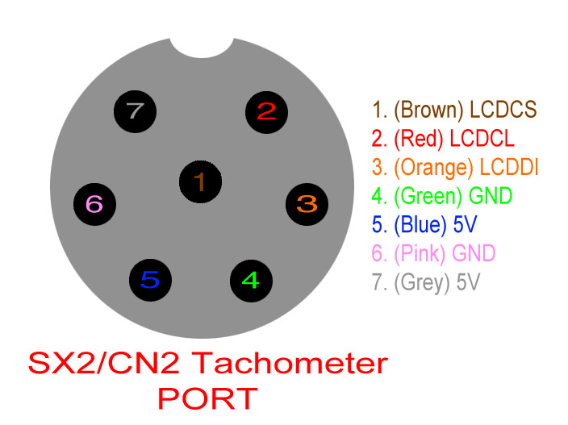
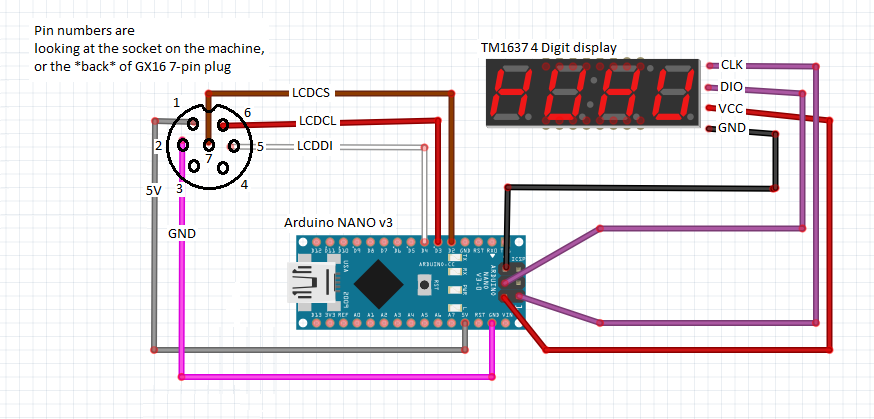

# Sieg Tacho

Project of tachometer device for Sieg SX2 Mill/SC2 Lathe (and probably some others)

## Hardware

To make this project you will need just three parts(not counting wiring)

* **Arduino Nano:**
 

* **TM1367 4-digit 7-segment indicator:**

* **Connector:**

## Pinout

Thanks to Jeffrey Nelson we know the pinout:

If you're interested in what's happening on the port, have a look at these pages:
https://macpod.net/misc/sx2_tachometer/sx2_tachometer.php

## Schematic

Connect wires accoring Andrew Whale schematic:

Double check wiring: pins on display may be in different location!

## Firmware

Use sketch from SiegTacho_v20 folder. To succesffuly build it you need to install TM1637 library by Avishay Orpaz using Library manager.

# Thanks

Many thanks to Jeffrey Nelson(Macpod LLC), Andrew McWhirter and Andrew Whale for sharing information regarding this project.